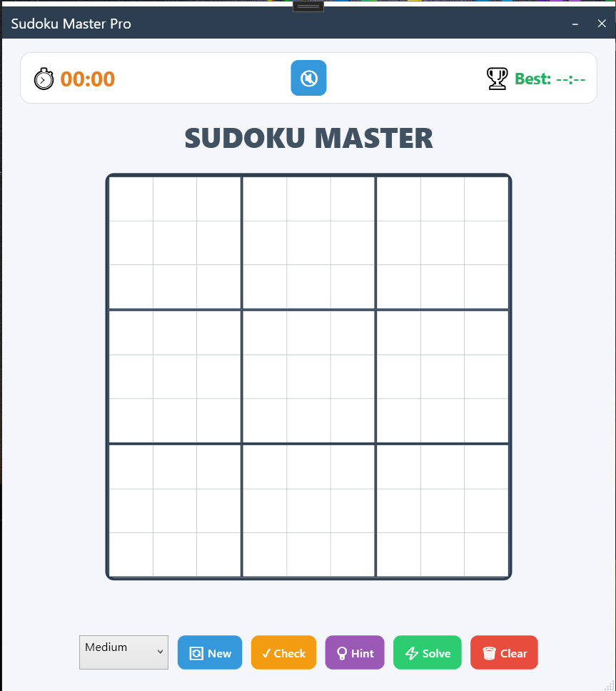

# 🧩 Sudoku Master Pro

 

A fast, elegant, and fully functional **Sudoku game** built with WPF and C#.  
Solve puzzles, get hints, track your best time, and enjoy relaxing background music.

---

## 🎥 Watch the Trailer / Gameplay

> *Click the image above to watch the gameplay demo on YouTube.*  

---

## ✨ Features

- 🧩 **Three difficulty levels** – Easy (40 empty cells), Medium (45), Hard (55)
- ⚡ **Smart solving engine** – Uses bitmasking + backtracking for instant solutions
- 💡 **Hint system** – Suggests a correct number for a random empty cell
- ⏱️ **Timer & Best Score** – Automatically saves your best time between sessions
- 🎵 **Background music** – Optional, with mute/unmute button
- 🎨 **Modern UI** – Custom title bar, smooth animations, and clean design
- ✅ **Validation** – Check board for duplicates before solving

---

## 📸 Screenshot

  
*Replace with an actual screenshot of your game.*

---

## 🖥️ System Requirements

- **OS**: Windows 10 or later (64-bit)
- **Runtime**: [.NET Desktop Runtime 10](https://dotnet.microsoft.com/en-us/download/dotnet/8.0) (if using Framework-dependent version)  
  *Or use the self-contained version (no runtime needed)*

---

## 📦 Downloads

| Version | Format | Size | Requirements |
|---------|--------|------|---------------|
| **Self-contained (x64)** | ZIP | ~80 MB | No additional runtime needed |
| **Framework-dependent** | ZIP | ~1 MB | .NET 10 Runtime required |

👉 **Recommended**: Download the self-contained ZIP for easiest setup.

---

## 🚀 How to Install & Play

1. Download the ZIP file for your preferred version from the [Releases](../../releases) page.
2. Extract all files to a folder.
3. Run `SudokuMaster-Pro.exe`.
4. Click **Generate New** to start a puzzle.
5. Fill cells with numbers 1–9.
6. Use **Check** to validate, **Hint** for help, and **Solve** to complete.

---

## 🎮 Controls

| Button | Action |
|--------|--------|
| **New** | Generates a random puzzle based on selected difficulty |
| **Check** | Verifies no duplicates exist |
| **Hint** | Fills one correct number (purple) |
| **Solve** | Completes the board automatically |
| **Clear** | Removes all user entries |
| 🔇/🔊 | Toggle background music |

---

## 🛠️ Built With

- **C#** – Core logic
- **WPF (.NET 10)** – UI framework
- **Bitmasking** – O(1) validation
- **Backtracking** – Unique solution guarantee

---

## 📝 Known Issues

- Background music file must be placed in `Assets/background_music.mp3` or `.webm` (if missing, music button will show muted).
- Icon may not appear on ClickOnce desktop shortcut – use the portable ZIP version instead.

---

## 🤝 Contributing

Contributions are welcome! Feel free to open an issue or submit a pull request.

---

## 📜 License

This project is licensed under the **MIT License** – see the [LICENSE](LICENSE) file for details.

---

## 🙏 Acknowledgments

- Inspired by classic Sudoku puzzles
- Built with Visual Studio 2026 and .NET community tools

---

**Enjoy the game!** If you like it, ⭐ star this repository.
